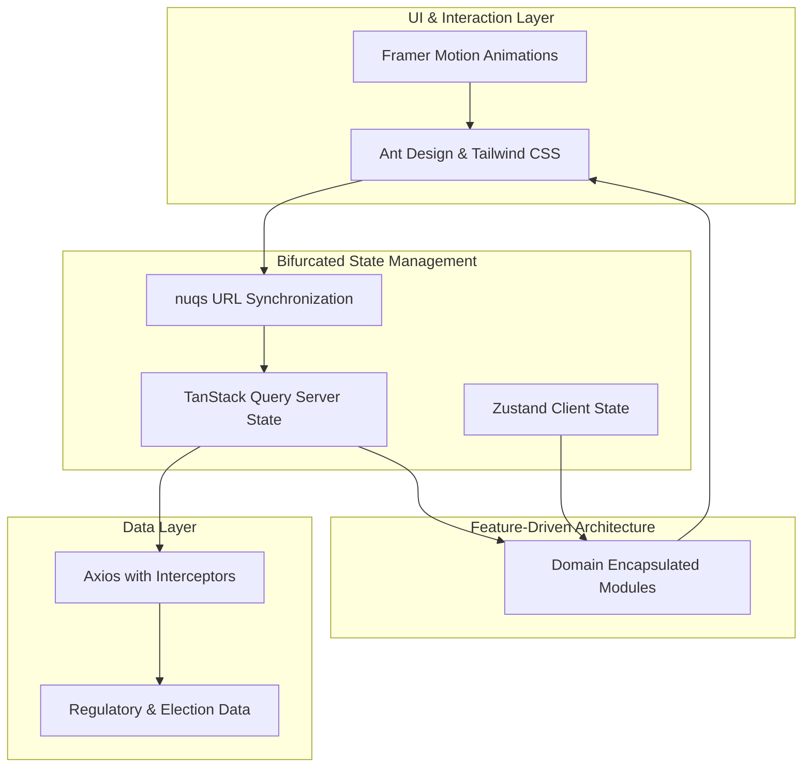

### Architecture at a Glance

### The Problem
Political stakeholders struggled with fragmented, high-density regulatory data that was difficult to parse, share, and track in real-time.

### The Solution
We engineered a high-velocity React interface that transforms dense legislative datasets into actionable intelligence. By synchronizing complex filter states directly to the URL and utilizing predictive caching, we deliver a seamless experience that prioritizes searchability and precision.

### The Impact
The platform replaces legacy complexity with a refined, authoritative aesthetic, enabling users to track regulatory shifts with total clarity and technical resilience.
