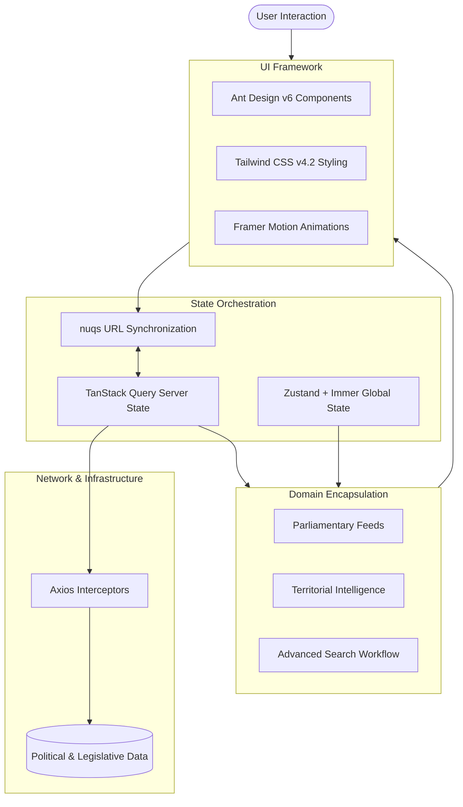

### Architecture at a Glance

### The Problem
Analysts were hindered by fragmented legislative data and opaque regulatory shifts, making it impossible to derive clear, timely intelligence from massive, noisy datasets.

### The Solution
We engineered a high-performance React ecosystem that leverages URL-first state synchronization and domain-driven design to manage intricate search workflows. The interface pairs authoritative, serif-led typography with fluid interactions, masking complex data-fetching latency to deliver a premium, high-density user experience.

### The Impact
This platform enables rapid, precise tracking of political activity, turning overwhelming complexity into a streamlined, bookmarkable intelligence stream for enterprise users.
