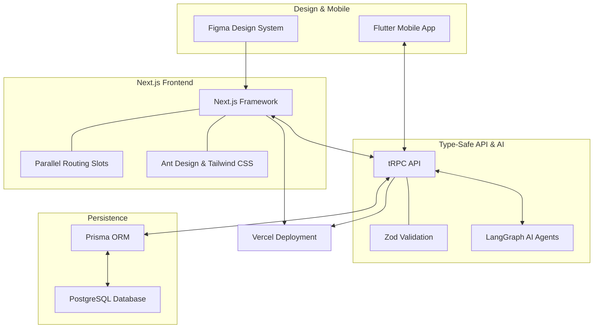

### Architecture at a Glance

### The Problem
Industrial operations often struggle with fragmented equipment data and complex workflows, leading to information overload for technicians and engineers alike.

### The Solution
We integrated state-machine AI agents and a role-based modular UI to deliver high-fidelity asset insights. By combining predictive logic with a streamlined, industrial-grade design system, we transformed dense operational datasets into intuitive, context-aware dashboards.

### The Impact
This platform eliminates cognitive friction, enabling teams to act on critical maintenance needs with precision while maintaining enterprise-grade safety and system-wide data integrity.
