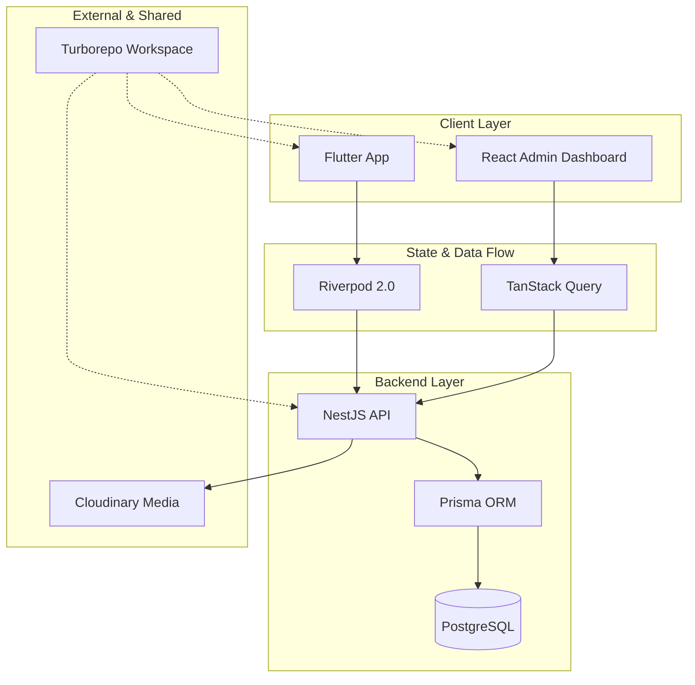

### Architecture at a Glance

### The Problem
Fitness users often abandon routines due to fragmented tracking, inconsistent guidance, and interfaces that feel cluttered or overwhelming.

### The Solution
We engineered a unified platform that delivers personalized fitness plans through a high-performance, dark-mode interface. The system leverages a type-safe architecture to ensure seamless data flow between coaching insights and user progress.

### The Impact
By prioritizing consistency over intensity, the platform transforms daily activity into scalable data. This design-led approach delivers a premium, fluid experience that keeps users engaged with their wellness journey.
