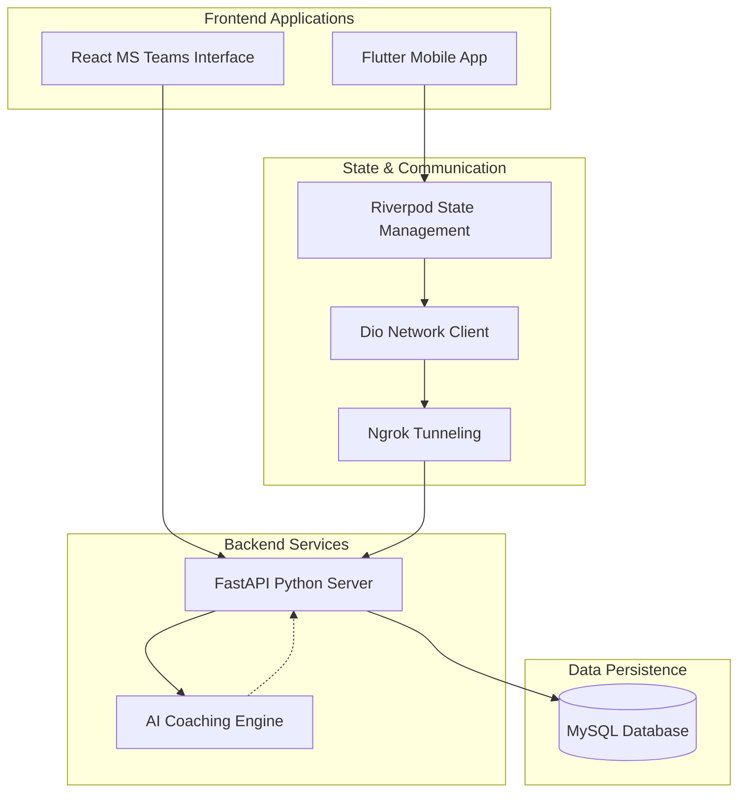

### Architecture at a Glance

### The Problem
Traditional coaching platforms often feel clinical and static, creating a disconnect between data-heavy analytics and the human nature of leadership growth.

### The Solution
We engineered a sophisticated, high-performance interface that synthesizes AI-driven insights with a warm, glassmorphic design system. By decoupling business logic from UI, we deliver a responsive experience that makes complex developmental feedback feel personal and intuitive.

### The Impact
A seamless, motion-rich ecosystem that transforms professional development into an engaging journey, ensuring users remain motivated through every interaction.
