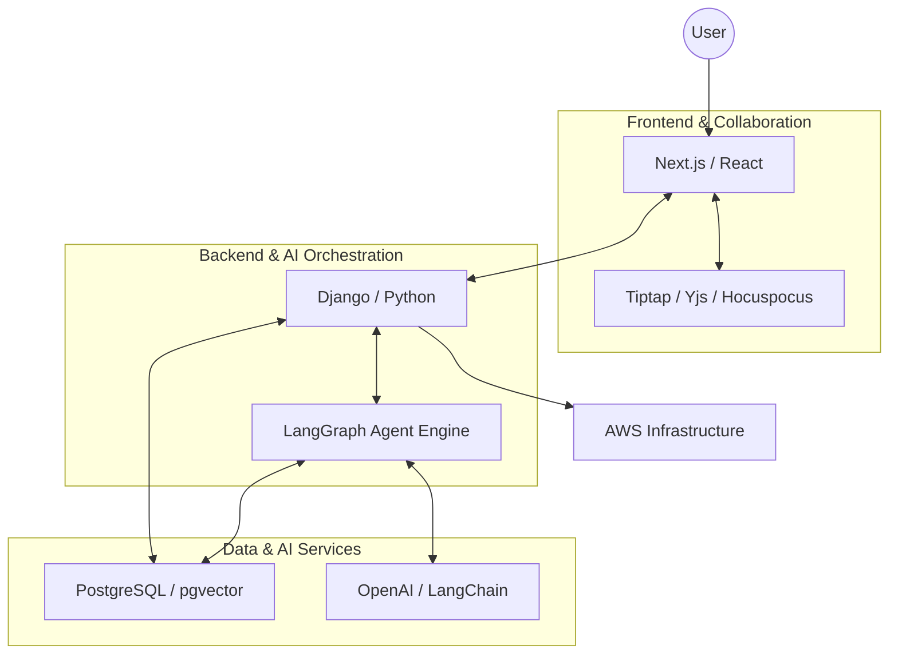

### Architecture at a Glance

### The Problem
Traditional AI tools feel like disconnected chatbots, forcing users to manage context, latency, and fragmented workflows manually.

### The Solution
We engineered a stateful multi-agent system that orchestrates specialized reasoning graphs, coupled with a real-time collaborative editor. By masking latency through dynamic UI feedback and granular state disclosure, the platform turns computational wait times into a polished, high-trust user journey.

### The Impact
This architecture bridges the gap between raw LLM power and professional utility, enabling users to generate, refine, and co-create complex documents with unprecedented precision.
