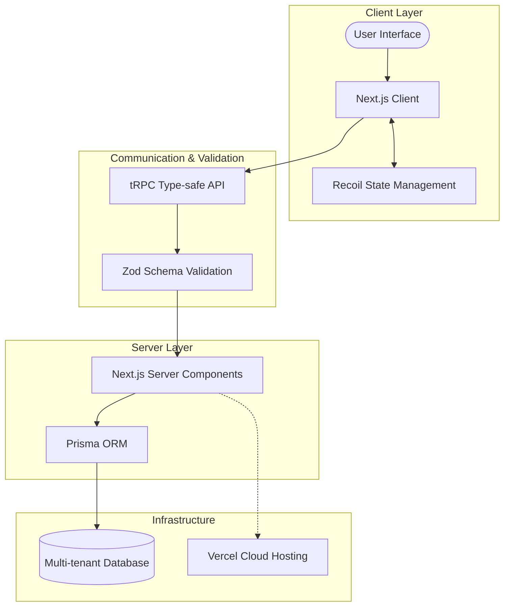

### Architecture at a Glance

### The Challenge
Heavy industry relies on fragmented, outdated systems that fail to track polymorphic assets across multiple sites, causing significant operational drag.

### The Design Philosophy
We engineered a clean, industrial-grade interface built for rapid data entry and clarity, ensuring that complex machinery metrics are always accessible and actionable.

### The Business Value
By leveraging a type-safe, unified data pipeline, the platform eliminates manual mapping errors and provides facility managers with instant, reliable oversight of their most critical assets.
