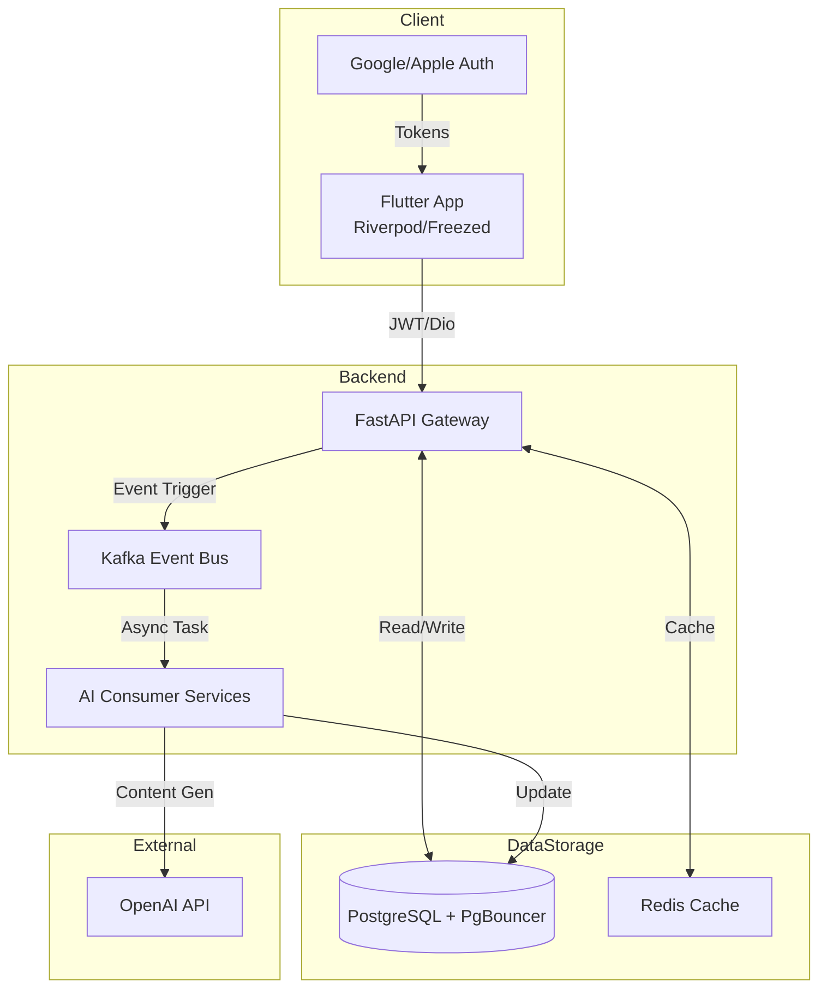

### Architecture at a Glance

### Mastering Language Through Intelligence and Design
Lexigram transforms language acquisition into a high-end lifestyle experience. By merging sophisticated AI orchestration with a polished, typography-first interface, the platform removes the friction typically associated with academic study. The architecture employs an event-driven model to process complex linguistic data in the background, ensuring the mobile interface remains fluid and responsive. Every interaction is grounded in a bespoke design system that prioritizes aesthetic clarity and cognitive flow. By abstracting advanced backend intelligence behind a seamless user experience, Lexigram provides a scalable, intuitive, and engaging tool for learners navigating the complexities of French vocabulary.
