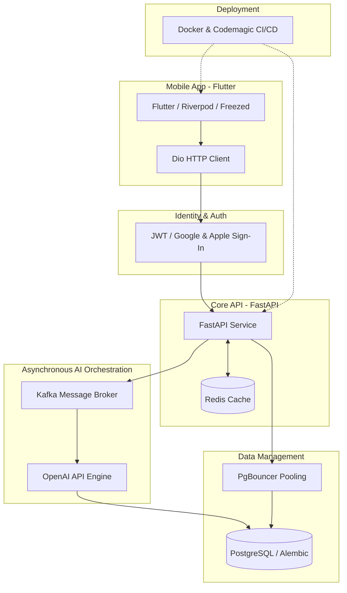

### Architecture at a Glance

### The Problem
Traditional language tools often feel clinical and static, failing to provide the interactive, personalized context necessary for true fluency.

### The Solution
We engineered an event-driven mobile ecosystem that fuses real-time AI generation with a premium design system, delivering a seamless, "lifestyle" educational experience.

### The Impact
By abstracting complex background processing into a fluid, tactile interface, Lexigram transforms technical mastery into an effortless, high-performance journey for thousands of global users.
