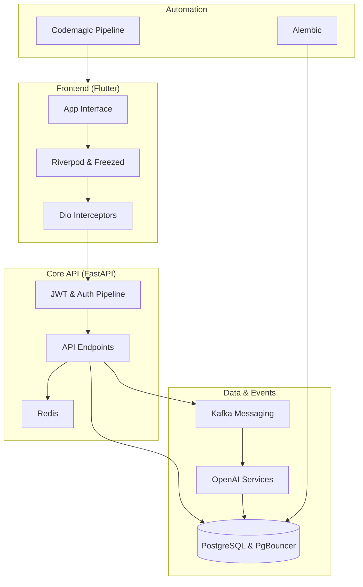

### Architecture at a Glance

### Elevating Language Acquisition Through Design
Lexigram transforms the language learning experience by replacing static study methods with an intelligent, gamified ecosystem. By leveraging event-driven architecture, the platform delivers real-time, CEFR-aligned content without the friction typically associated with AI-integrated tools. The interface embraces a refined "Aura" design system, utilizing glassmorphism and subtle micro-interactions to create a premium lifestyle feel. Every element is crafted to reduce cognitive load, ensuring that users remain immersed in their progress while the backend seamlessly orchestrates complex data processing behind a frictionless, high-speed mobile interface.
