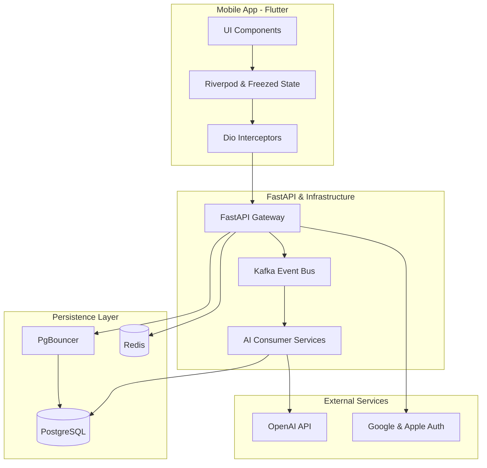

### Architecture at a Glance

### Redefining Language Acquisition Through Design
Lexigram elevates the language learning experience by merging high-performance architecture with a premium aesthetic. By utilizing an event-driven backend, the application performs complex AI-driven content generation asynchronously, ensuring the interface remains fluid and responsive. The design philosophy centers on a bespoke "Aura" system, where glassmorphism and intentional typography reduce cognitive load, allowing users to focus entirely on their progress. Through the perfect synergy of intelligent data orchestration and a meticulously crafted UI, the platform transforms the traditionally tedious process of vocabulary building into an engaging, high-end digital ritual.
