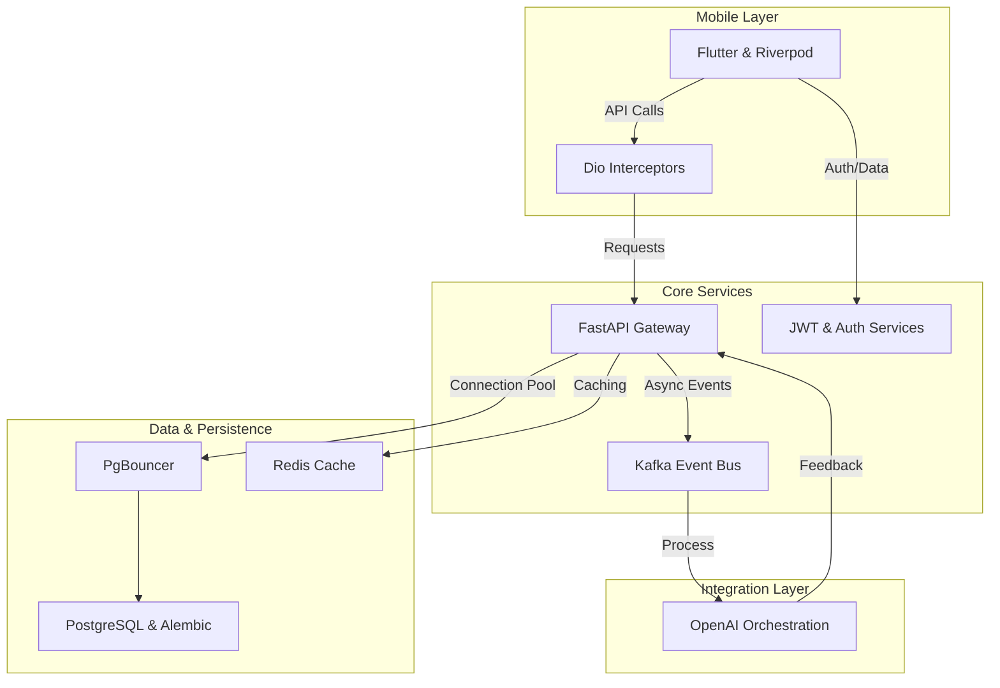

### Architecture at a Glance

### Elevating Language Acquisition Through Design
Lexigram transforms the language-learning experience into a sophisticated lifestyle tool, moving beyond traditional educational utilities. By prioritizing a clean, typography-focused hierarchy and a bespoke "Aura" design system, we reduced cognitive load and created an environment where users can engage deeply with content. The interface balances high-depth visual elements like glassmorphism and micro-animations, ensuring that every interaction feels tactile and rewarding. The result is a polished, premium aesthetic that masks complex background processes, allowing learners to focus entirely on their progress without the distraction of a cluttered user interface.

### Intelligent Infrastructure at Scale
The platform excels by marrying rapid, reactive frontend performance with a highly resilient backend. Through an event-driven architecture, Lexigram performs complex AI orchestration-such as generating contextual language examples and image associations-without ever stalling the user experience. By implementing advanced caching strategies and an immutable state management layer, we achieved a zero-latency feel that remains consistent across high traffic volumes. This approach ensures that the sophisticated, AI-driven learning path-including spaced repetition and dynamic puzzles-remains fluid, reliable, and accessible on any device, setting a new standard for modern edtech products.
