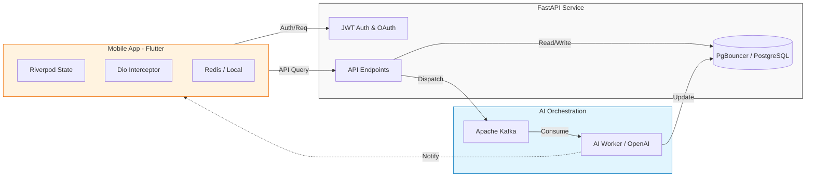

### Architecture at a Glance

### Linguistic Mastery, Elevated
Lexigram redefines language learning by bridging the gap between rigorous educational science and premium consumer design. By utilizing an event-driven AI architecture, the platform delivers real-time, context-aware vocabulary insights that adapt to the user's progress. Our design philosophy prioritizes a clean, "Aura" based aesthetic that removes cognitive friction, ensuring that users remain immersed in the learning process. The result is a seamless, high-velocity tool that masks complex backend intelligence behind an intuitive interface, making the path to fluency feel both effortless and profoundly rewarding.
