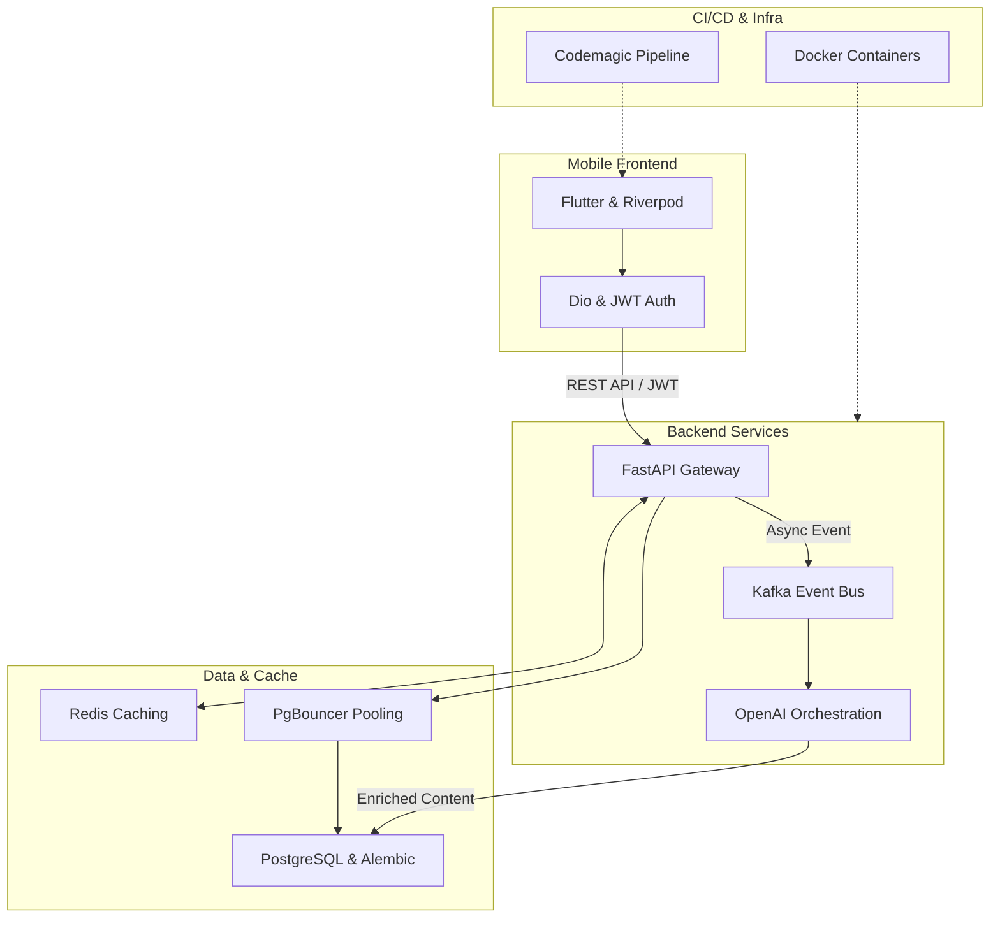

### Architecture at a Glance

### Redefining Language Acquisition
Lexigram transforms language learning from a chore into a lifestyle experience by blending sophisticated AI orchestration with a polished, intuitive interface. The platform utilizes an event-driven backend to deliver real-time, context-aware content without sacrificing performance. By abstracting complex machine-learning workflows, we allow users to focus entirely on their growth. The result is a seamless environment where advanced spaced repetition and gamified interactions feel natural, responsive, and deeply engaging, setting a new benchmark for how modern educational technology should function and feel.
