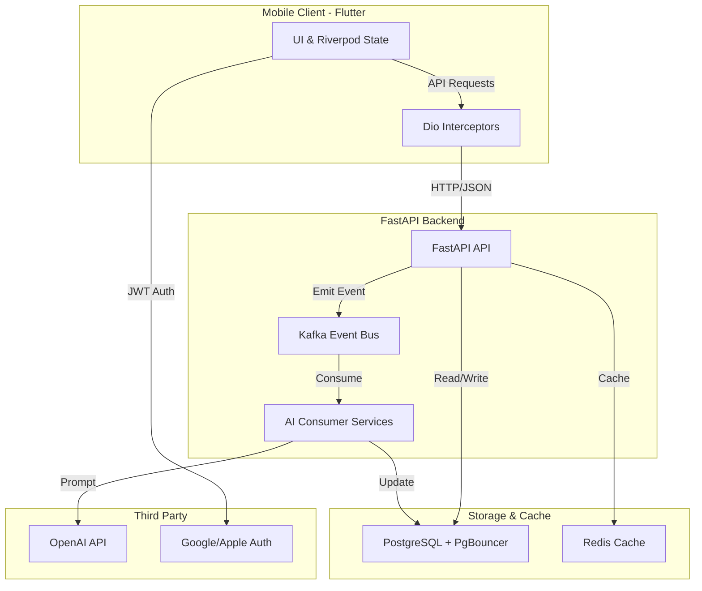

### Architecture at a Glance

### Redefining Language Acquisition
Lexigram transforms language learning from a static task into an immersive, premium experience. By integrating advanced AI orchestration with a reactive mobile framework, the platform delivers a zero-latency learning environment that adapts to the user's progress in real time. We prioritize a design-led approach, utilizing a bespoke aesthetic system and intuitive micro-interactions to minimize cognitive load. This synthesis of robust backend engineering and sophisticated UI/UX ensures that complex educational tools feel personal, responsive, and effortlessly accessible for learners at every stage of their journey.
