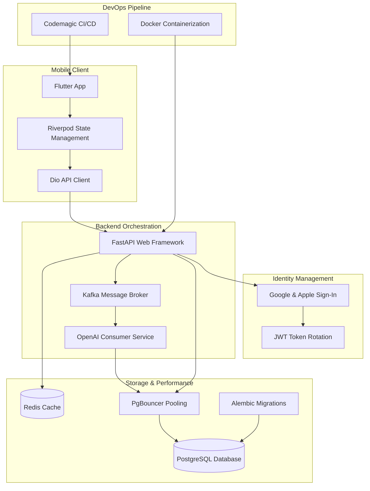

### Architecture at a Glance

### Mastering French, Reimagined
This platform redefines language acquisition, transforming the challenge of learning French vocabulary into an engaging, gamified journey. It seamlessly integrates interactive quizzes and intelligent word cards, guiding users through personalized, AI-driven learning paths designed for gradual mastery. The design embraces a "Premium Aura" philosophy, utilizing sophisticated glassmorphism and dynamic themes for an immersive, lifestyle-centric experience. Every interaction is crafted to reduce cognitive load, making complex language concepts intuitive and enjoyable.
