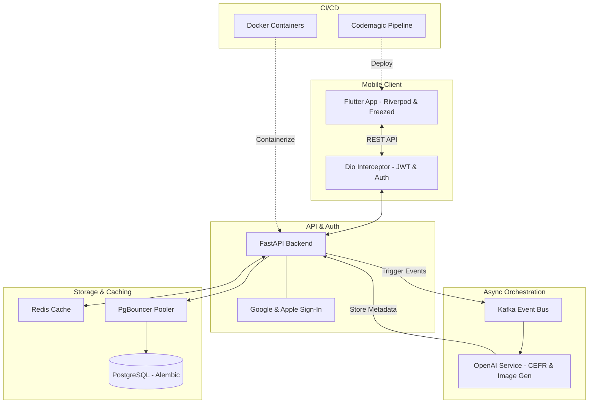

### Architecture at a Glance

### Elevating the Language Learning Experience
Lexigram reimagines digital education by transforming technical complexity into a seamless, high-end user journey. By utilizing an event-driven architecture, the platform offloads resource-heavy AI tasks from the primary user flow, ensuring a zero-latency experience. The result is a highly responsive tool that feels both alive and personal. Through a bespoke design system defined by glassmorphism and intentional typographic hierarchy, we have stripped away the friction typically associated with learning, allowing users to focus entirely on their progress through an interface that is as functional as it is aesthetic.
