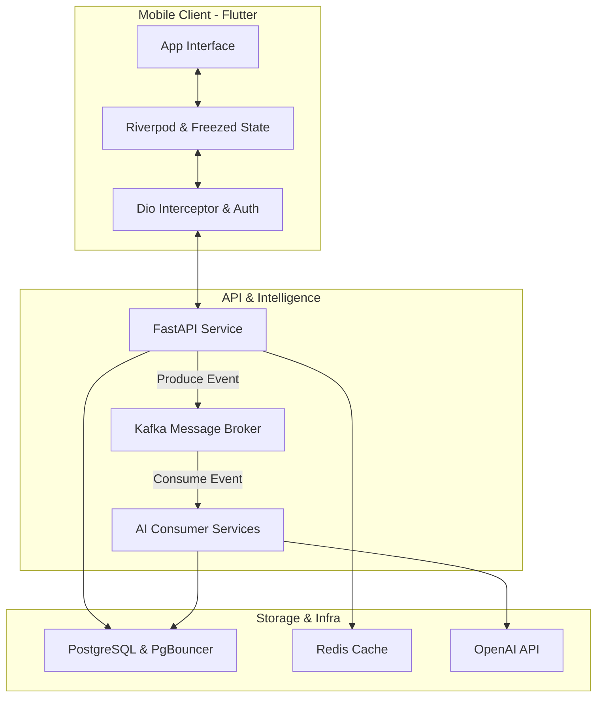

### Architecture at a Glance

### Elevating Language Mastery Through Intelligence
Lexigram transforms language acquisition into a frictionless, premium experience. By leveraging an asynchronous event-driven architecture, the platform offloads complex AI processing, ensuring users interact with a responsive and fluid interface. The application treats education as a lifestyle tool, employing a bespoke design system that utilizes glassmorphism and refined typography to minimize cognitive load. Through the seamless integration of spaced repetition and dynamic, context-aware content generation, the platform offers a uniquely personalized learning journey that remains both highly performant and aesthetically captivating, setting a new standard for intelligent educational technology.
