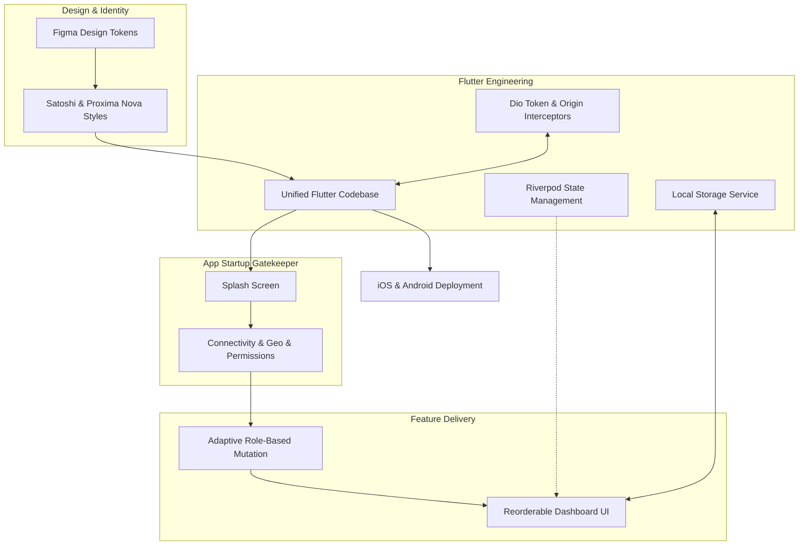

### Architecture at a Glance

### The Problem
Professional drivers required a robust, high-readability interface capable of managing complex fleet metrics without the cognitive friction of standard utility applications.

### The Solution
We engineered a high-performance, role-based mobile environment featuring a dynamic, user-configurable dashboard and a unified codebase that scales across diverse hardware.

### The Impact
By blending high-contrast "Luxury Dark" aesthetics with rigorous network resilience, we transformed a standard driver interface into a premium, responsive workplace for mobile-first professionals.
