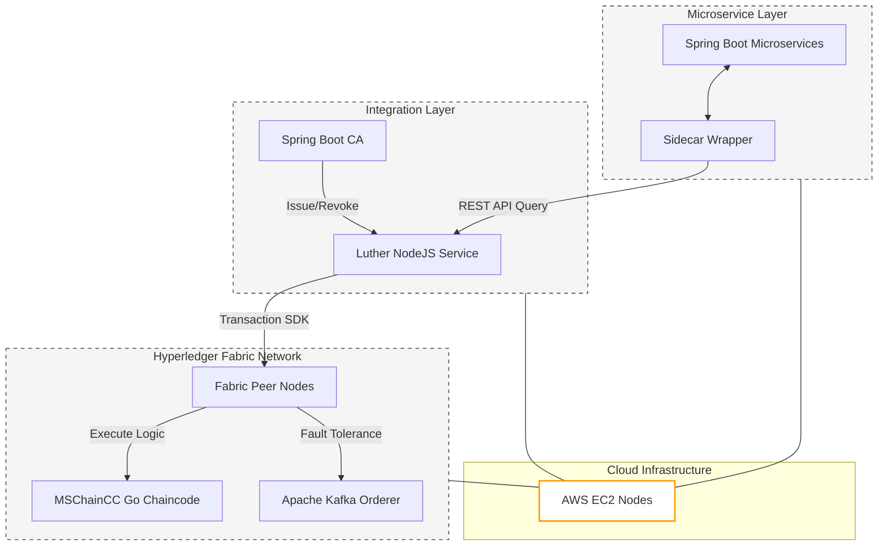

### Architecture at a Glance

### The Problem
Modern microservices rely on centralized authorities, creating single points of failure that leave service-to-service communication vulnerable to fraudulent certificates and man-in-the-middle attacks.

### The Solution
We engineered a decentralized verification system using Hyperledger Fabric to record certificate lifecycles on an immutable ledger. By integrating a sidecar pattern, services independently validate certificate status in real time without external reliance.

### The Impact
This architecture eliminates trust-based vulnerabilities, providing an auditable and resilient security layer that scales seamlessly across complex, distributed enterprise cloud environments.
