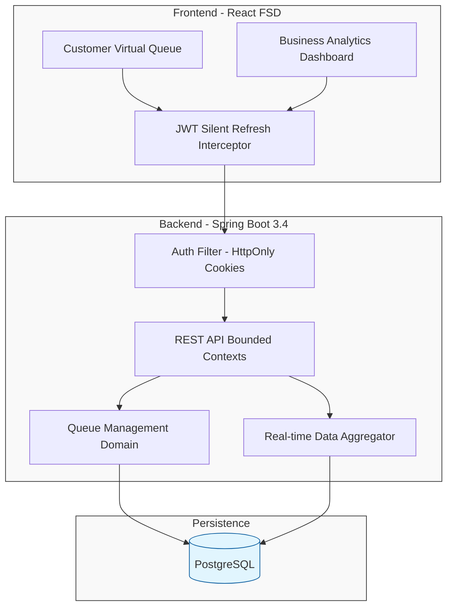

### Architecture at a Glance

### The Problem
Traditional physical queues cause service bottlenecks, resulting in lost revenue and poor customer experiences for high-traffic businesses.

### The Solution
We engineered a virtual management system using a domain-driven backend and a modular frontend to deliver real-time wait tracking.

### The Impact
The platform empowers businesses to eliminate crowding while providing customers with a transparent, low-friction journey. It turns operational data into actionable insights for the service economy.
