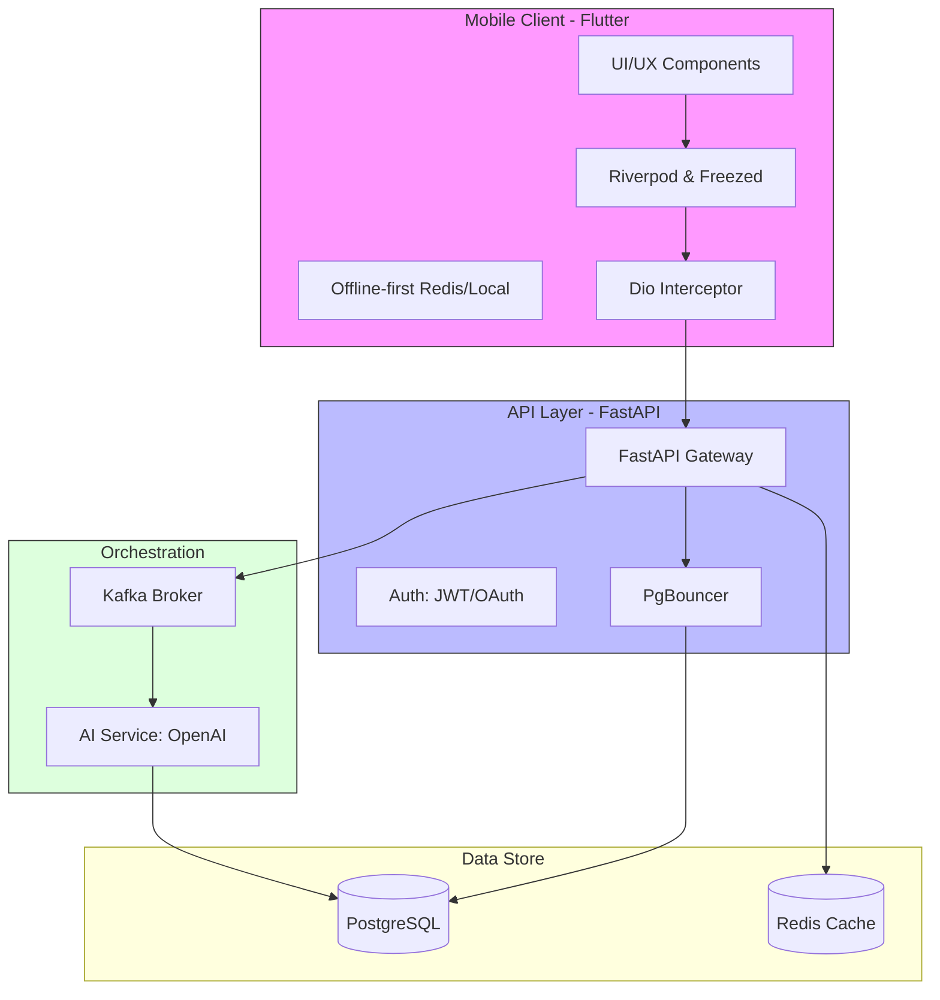

### Architecture at a Glance

### The Future of Fluent Interaction
Lexigram redefines the educational landscape by bridging the gap between rigorous cognitive science and high-end digital aesthetics. By replacing traditional, static learning models with an event-driven AI engine, the platform delivers personalized French vocabulary mastery that feels both immediate and effortless. Our approach focuses on removing the friction of manual progress, allowing the application to intelligently adapt to individual learning styles through real-time data synthesis. The result is an application that functions with industrial-grade reliability while maintaining the sleek, inviting feel of a modern lifestyle tool.

### Design as a Cognitive Catalyst
We treated the interface not as a container for data, but as an essential component of the learning process itself. By utilizing a bespoke glassmorphism-based design system and a strictly managed typographic hierarchy, we reduced the cognitive overhead typically associated with language study. Every micro-interaction, from haptic feedback to fluid system-wide theme transitions, is engineered to sustain user engagement. Lexigram serves as a benchmark for product design, proving that complex technical architecture can be hidden behind an elegant, serene, and highly accessible user experience.
