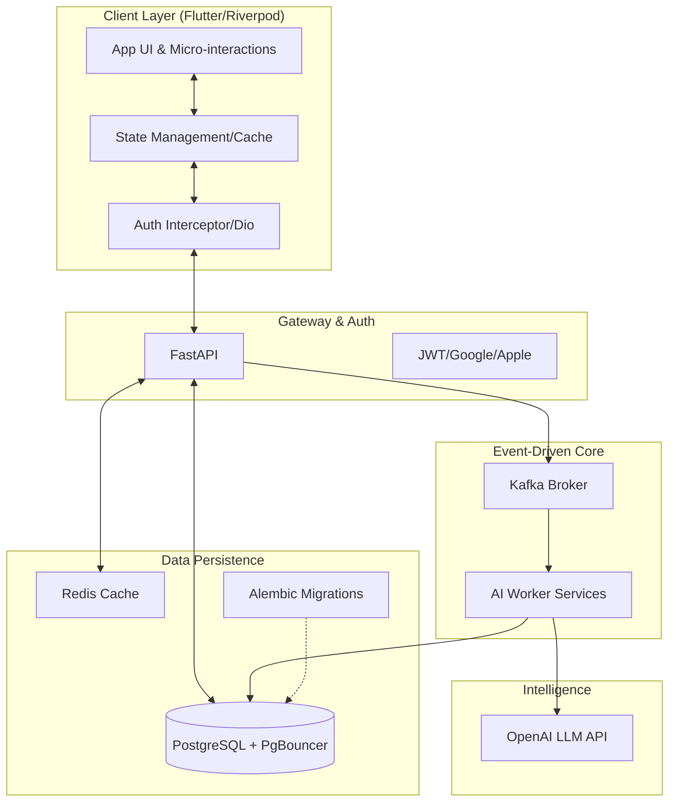

### Architecture at a Glance

### Elevating the Language Learning Experience
Lexigram transforms the arduous process of vocabulary acquisition into a fluid, lifestyle-driven experience. By moving away from static educational templates, we engineered a platform that feels both personal and high-end. The product utilizes an intelligent, event-driven architecture to deliver real-time AI content without sacrificing performance. Through a bespoke design system built on glassmorphism and HSL-curated palettes, we created a distraction-free environment that prioritizes cognitive clarity, ensuring every interaction feels intentional, rewarding, and remarkably fast. Lexigram is a benchmark for how complex AI products can prioritize elegance alongside industrial-grade reliability.
