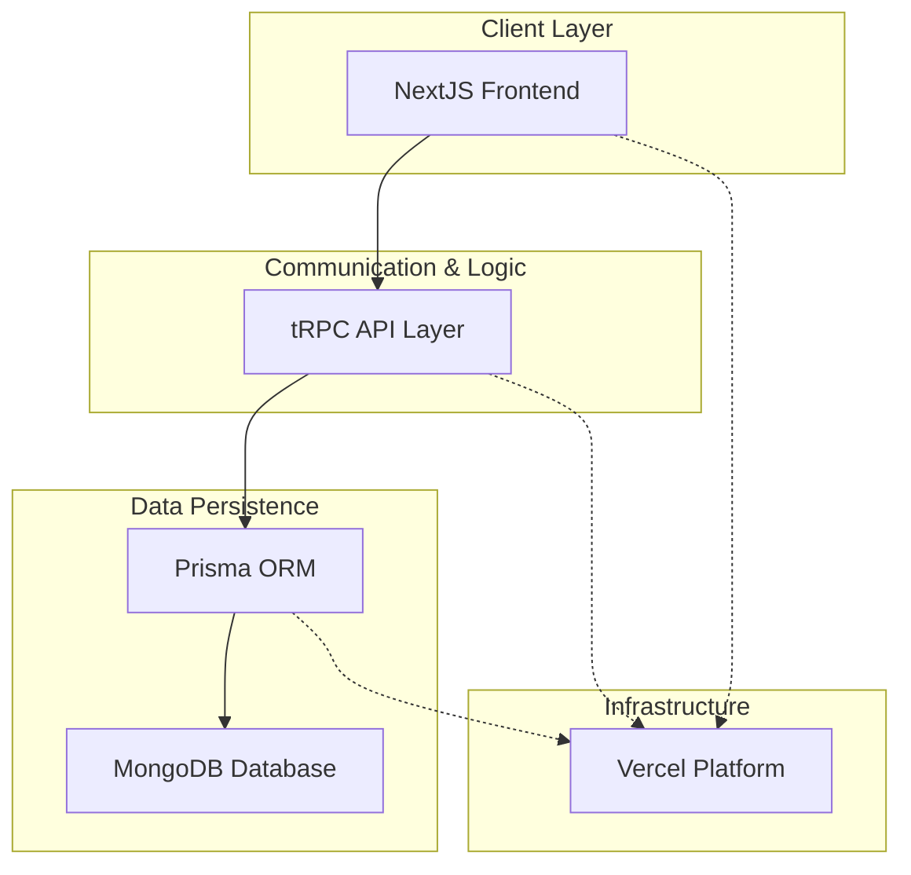

### Architecture at a Glance

### The Problem
Fragmented data and manual weighing processes caused significant bottlenecks, leading to inconsistent records and operational inefficiencies in agricultural procurement.

### The Solution
A unified, responsive management system that synchronizes real-time weighing data with secure backend infrastructure to ensure end-to-end transparency.

### The Impact
By automating complex data flows, we minimized human error and optimized throughput, providing stakeholders with an intuitive, reliable tool for mission-critical logistics.
