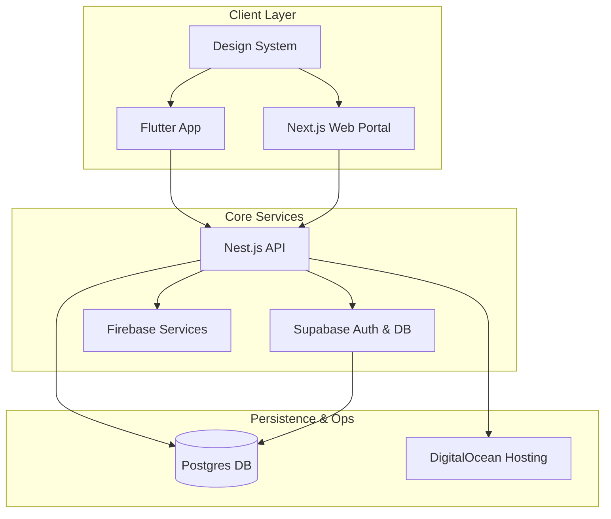

### Architecture at a Glance

### The Problem
Traditional exam preparation tools are often fragmented, offering static interfaces that fail to bridge the gap between content creators and learners effectively.

### The Solution
We engineered a robust, decoupled ecosystem that synchronizes expert-curated content with a bespoke, lightweight UI. By separating financial truth from content access, we ensured seamless, high-performance interactions across all student touchpoints.

### The Impact
A refined learning environment where fluid micro-interactions and intelligent state management empower users to focus exclusively on concept mastery, rather than navigating technical friction.
