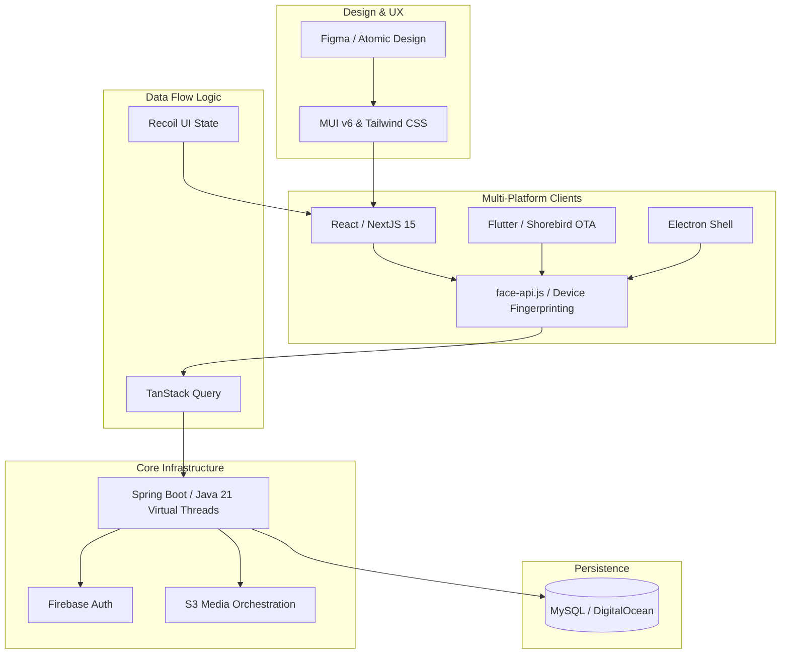

### Architecture at a Glance

### The Problem
Educational platforms often struggle with fragmented media handling, sluggish interfaces, and inadequate protection against intellectual property theft and session fraud.

### The Solution
We engineered a security-hardened, multi-tenant infrastructure featuring an intuitive design system that reconciles high-speed media orchestration with advanced, privacy-first integrity monitoring.

### The Impact
By unifying cross-platform native shells with a zero-latency web architecture, we established a new standard for reliability and user trust, enabling educators to deliver protected content with uncompromising fluidity.
